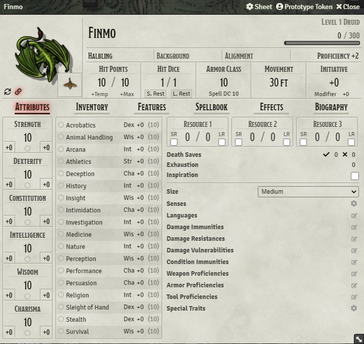

# Actor-Token-Sync

Foundry VTT module that synchronizes Actors and their (Prototype) Tokens. Makes sure that Name and Image stay in Sync.

## Features

- Whenever you change an Actor's name, the corresponding prototype token's name updates automatically. 
  No idea why this isn't default functionality in Foundry VTT.
- For DnD5e: When the actor and the prototype token have different images configured, both images are shown in the 
  actor sheet:

  
  
  - Hover over one of the images to see the full image
  - Click the token image (bottom-right) to bring up the prototype token dialog
  - Click the "Sync" button in the bottom-left corner (arrow symbol) to set the prototype token's image to the 
    actor's image.
  - Click the "Link" button (chain symbol in bottom-left corner) to toggle the prototype token's "Link Actor Data" 
    setting.
    
## Changelog

- **1.1.0:** Fixed UI breaking when wildcard tokens are used. Changed split view to a more conventional PiP-View
- **1.0.0:** Initial release with prototype token name sync and manual image sync for DnD5e

## About

Feel free to suggest features and report bugs via Github issues!

If you want to show your support for my work financially, feel free to donate via PayPal - it's greatly appreciated! 

